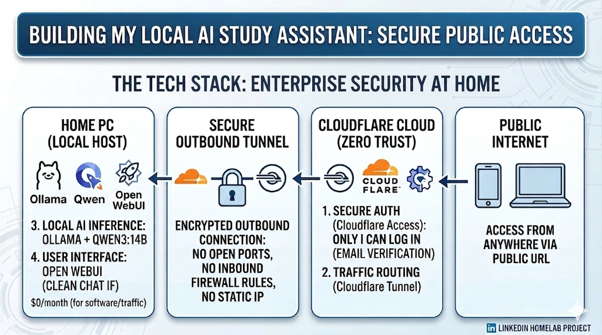

# 🤖 AI Study Assistant + Zero Trust Network Access
> A private, self-hosted AI study assistant secured with a Zero Trust access model — built on personal hardware for $0.


---

## 📌 Overview

This project combines a locally-hosted AI assistant with enterprise-grade Zero Trust security — accessible from any device, anywhere in the world, with no open ports and no static IP exposed.

Built as a study tool for cybersecurity certification prep, it also serves as a hands-on implementation of the same ZTNA architecture used in enterprise environments.

---

## 🏗️ Architecture




```
[Any Device] 
     │
     ▼
[Cloudflare Edge]
     │  Bot Fight Mode — blocks automated scanners
     │  Page Shield — monitors client-side scripts
     │
     ▼
[Cloudflare Access] ── Identity verification (email OTP)
     │                   Nothing passes without authentication
     │
     ▼
[Cloudflare Tunnel] ── Encrypted outbound-only connection
     │                   No open ports. No static IP. No inbound rules.
     │
     ▼
[Windows PC - Local Hardware]
     │
     ▼
[Open WebUI] ──► [Ollama + qwen3:14b]
```

**Traffic never reaches the machine without passing identity verification first.**

---

## 🛠️ Stack

| Component | Role |
|---|---|
| [Ollama](https://ollama.com) + qwen3:14b | Local AI inference on personal hardware |
| [Open WebUI](https://github.com/open-webui/open-webui) | Self-hosted chat interface |
| [Cloudflare Tunnel](https://developers.cloudflare.com/cloudflare-one/connections/connect-networks/) | Encrypted outbound-only connection, zero inbound exposure |
| [Cloudflare Access](https://developers.cloudflare.com/cloudflare-one/policies/access/) | Identity-based access control, email verification |
| [Cloudflare Bot Fight Mode](https://developers.cloudflare.com/bots/get-started/free/) | Automated scanner and bot blocking |
| [Cloudflare Page Shield](https://developers.cloudflare.com/page-shield/) | Client-side script integrity monitoring |
| PWA (Progressive Web App) | Native-feeling mobile access, no App Store required |

---

## 🔐 Security Architecture

### Network Layer (L3)
- **Zero inbound firewall rules** — attack surface eliminated at the network layer
- **No static IP exposed** — all traffic proxied through Cloudflare's edge
- **No open ports** — outbound-only tunnel, nothing listens externally

### Identity Layer
- **Cloudflare Access** gates every request with email-based OTP verification
- Authentication happens at Cloudflare's edge — unauthenticated traffic never reaches the machine

### Application Layer
- **Bot Fight Mode** blocks automated scanners and crawlers before they reach Access
- **Page Shield** monitors client-side JavaScript for malicious or compromised scripts

### Defense in Depth
```
Internet Traffic
      │
      ▼
 Bot Fight Mode (block scanners)
      │
      ▼
 Page Shield (monitor scripts)
      │
      ▼
 Cloudflare Access (identity gate)
      │
      ▼
 Cloudflare Tunnel (encrypted, outbound-only)
      │
      ▼
 Local Machine (never directly exposed)
```

---

## 🚀 How to Replicate This

### Prerequisites
- Windows PC with enough RAM to run a 14B parameter model (16GB+ recommended)
- A domain name (Cloudflare offers free DNS)
- A free Cloudflare account

### 1. Install Ollama
```powershell
# Download from https://ollama.com and run installer
ollama pull qwen3:14b
ollama serve
```

### 2. Install Open WebUI
```powershell
# Requires Docker Desktop for Windows
docker run -d -p 3000:8080 `
  --add-host=host.docker.internal:host-gateway `
  -v open-webui:/app/backend/data `
  --name open-webui `
  ghcr.io/open-webui/open-webui:main
```

### 3. Set Up Cloudflare Tunnel
```powershell
# Install cloudflared
winget install --id Cloudflare.cloudflared

# Authenticate
cloudflared tunnel login

# Create tunnel
cloudflared tunnel create ai-study-assistant

# Configure tunnel (create config.yml)
# Route tunnel to your Open WebUI instance
cloudflared tunnel route dns ai-study-assistant yourdomain.com

# Run as Windows service
cloudflared service install
```

### 4. Configure Cloudflare Access
1. Go to Cloudflare Zero Trust dashboard
2. Access → Applications → Add an application
3. Set policy: allow only your email address
4. Enable one-time PIN (OTP) authentication

### 5. Enable Bot Fight Mode
1. Cloudflare Dashboard → Security → Bots
2. Toggle **Bot Fight Mode** on

### 6. Enable Page Shield
1. Cloudflare Dashboard → Security → Page Shield
2. Toggle on and configure alerts

### 7. Install as PWA (iPhone)
1. Open your domain in Safari
2. Share → Add to Home Screen
3. Done — works like a native app

---

## 💡 What I Learned

Turns out deploying it once taught me more than I expected.

Reading about Zero Trust principles is one thing. Actually implementing the identity layer, understanding why outbound-only tunnels eliminate inbound attack surface, and debugging authentication flows at midnight — that's where the real understanding comes from.

Key concepts this project covers hands-on:
- Zero Trust Network Access (ZTNA)
- Defense in depth
- Identity-based access control
- Encrypted tunneling
- Bot mitigation
- Client-side security monitoring
- Progressive Web Apps

---

## 📎 Related

- [Cloudflare Zero Trust Docs](https://developers.cloudflare.com/cloudflare-one/)
- [Ollama Model Library](https://ollama.com/library)
- [Open WebUI Docs](https://docs.openwebui.com)

---

*Built on Windows. Secured with Cloudflare. Runs 24/7 for $0.*
